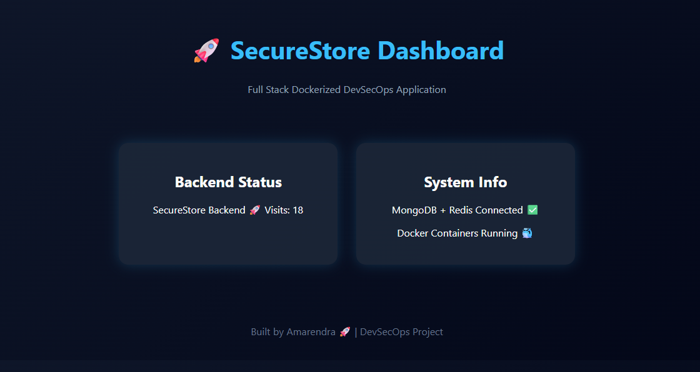
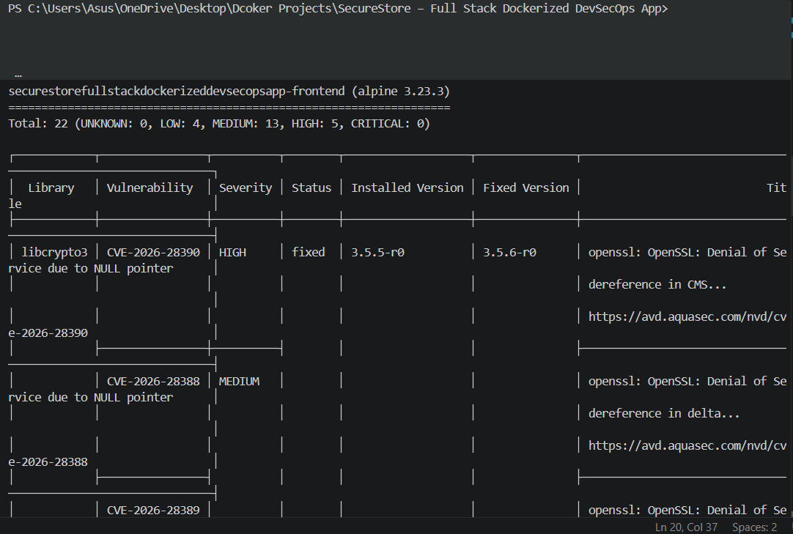
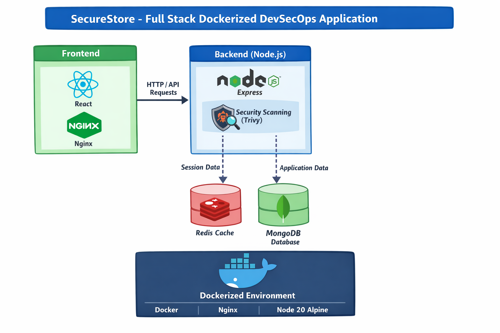
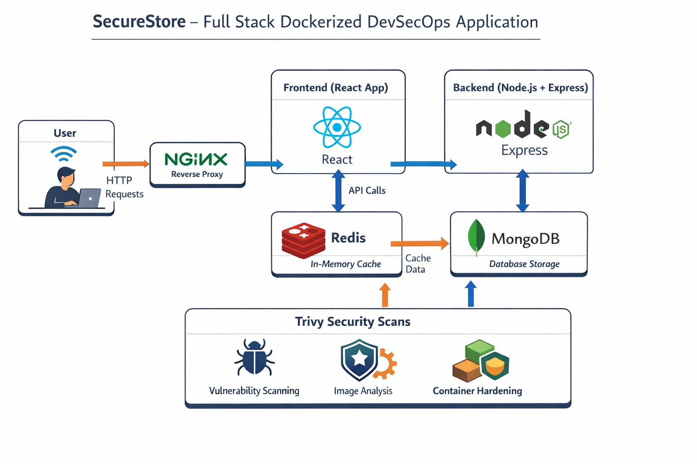

# 🚀 SecureStore – Full Stack Dockerized DevSecOps Application

A production-style full stack application demonstrating modern **DevOps + DevSecOps practices** using Docker.

---

## 🧩 Tech Stack

* ⚛️ **Frontend**: React (served via Nginx)
* 🟢 **Backend**: Node.js + Express
* 🍃 **Database**: MongoDB
* ⚡ **Cache**: Redis
* 🐳 **Containerization**: Docker & Docker Compose
* 🔐 **Security Tool**: Trivy (Vulnerability Scanner)

---

## 🏗️ Architecture Overview

This application follows a microservice-style architecture:

User → Nginx → React Frontend → Node.js Backend → Redis (Cache) + MongoDB (Database)

---

## ✨ Features

* Full stack Dockerized application
* REST API integration
* Redis-based visit counter (caching)
* MongoDB persistent storage
* Multi-container orchestration using Docker Compose
* Nginx as reverse proxy & static server
* DevSecOps security scanning using Trivy
* Container hardening (non-root user, minimal base image)

---

## 🔐 DevSecOps & Security

### 🧪 Vulnerability Scanning with Trivy

Trivy is a powerful open-source tool used to scan:

* Docker images
* OS packages
* Application dependencies

---

### 📊 Scan Results

#### Before Hardening:

* CRITICAL: 2 ❌
* HIGH: 9+
* MEDIUM: Many

#### After Hardening:

* CRITICAL: 0 ✅
* HIGH: Reduced
* MEDIUM: Reduced

---

### 🛡️ Security Improvements

* Upgraded base image → `node:20-alpine`
* Removed unnecessary dependencies
* Implemented non-root user inside container
* Reduced attack surface
* Cleaned Docker build context

---

## 🛠️ How to Run the Project

```bash
docker-compose up --build
```

---

## 🌐 Access Application

* Frontend → http://localhost:3001
* Backend API → http://localhost:3000/api

---

## 🔍 How to Install Trivy

### 🖥️ Option 1: Using Docker (Recommended)

```bash
docker run --rm aquasec/trivy:0.50.1 image IMAGE_NAME
```

Example:

```bash
docker run --rm aquasec/trivy:0.50.1 image securestore-backend
```

---

### 🖥️ Option 2: Install Locally (Linux/Mac)

```bash
brew install trivy
```

OR

```bash
sudo apt install trivy
```

---

### 🖥️ Option 3: Windows (Manual)

1. Download from: https://github.com/aquasecurity/trivy/releases
2. Extract ZIP
3. Add to PATH
4. Run:

```bash
trivy image IMAGE_NAME
```

---

## 🔎 How to Run Trivy Scan

Scan backend image:

```bash
trivy image securestorefullstackdockerizeddevsecopsapp-backend
```

Scan frontend image:

```bash
trivy image securestorefullstackdockerizeddevsecopsapp-frontend
```

---

## 📸 Screenshots

### 🖥️ Dashboard UI



### 🔐 Vulnerability Scan



### 🏗️ Architecture



### 🔄 System Flow



---

## 🧠 Key Learnings

* Docker multi-container architecture
* Reverse proxy using Nginx
* Redis caching strategy
* MongoDB integration
* DevSecOps practices (scan + harden)
* Vulnerability management using Trivy

---

## 👨‍💻 Author

**Amarendra Prakash**
DevSecOps & Cybersecurity Enthusiast 🚀

---

## ⭐ Future Improvements

* CI/CD integration (GitHub Actions)
* Authentication system (JWT)
* Deployment on cloud (AWS / GCP)
* Advanced monitoring (Prometheus, Grafana)
